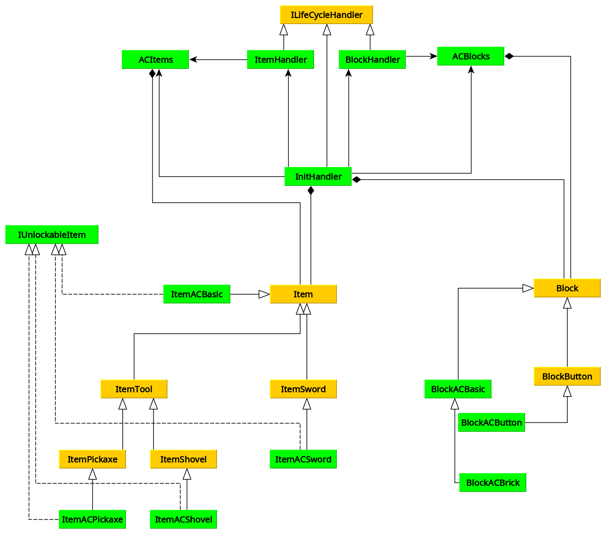
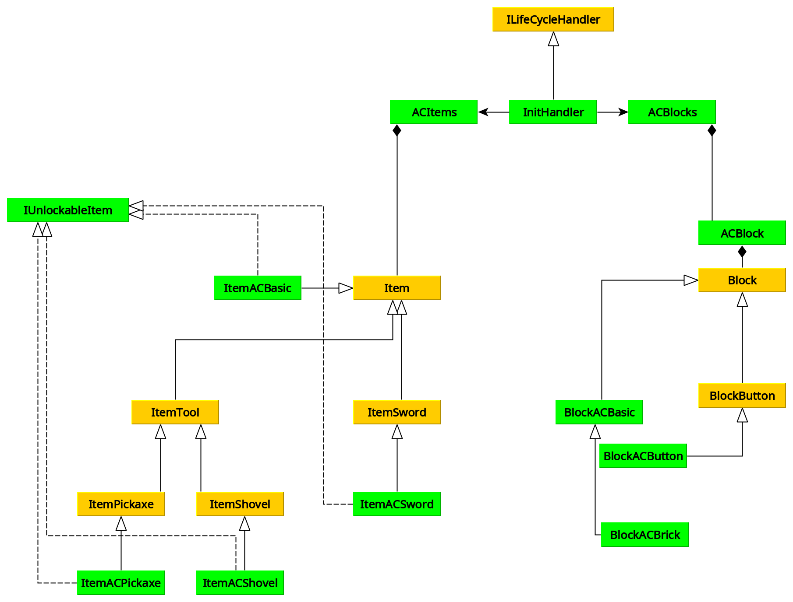

# Refactoring 'AbyssalCraft' and the Minecraft Forge API

## Context

Minecraft is a popular video game where players discover and build a block-based world. Minecraft Forge is a community
initiative to modify and extend the original game features. It consists of a reverse-engineered version of the original
game that exposes an API for mod developers to use.

## Introduction

Multiple attempts to refactor the Minecraft mod 'AbyssalCraft' failed, for which the Minecraft Forge API is to blame.
This document reports the analysis of the codebase, explaining which components need to be refactored most urgently and
how the refactoring could take place starting from the Minecraft Forge API.

## Finding weak points

A common 'design smell' for codebases are large files. An appropriate software system architecture scales to the system
needs, without sacrificing maintainability and extensibility. If a codebase needs large files, it most likely is because
of repetitive code.

The following GNU+Linux command was used to find the largest files in terms of LOC (lines of code):

```shell
rg -c '^' . | sort -n -k2 -t :
```

This uses [ripgrep](https://github.com/BurntSushi/ripgrep) to count the lines of each file and then [sort]
(https://www.gnu.org/software/coreutils/sort) to sort the files based on the number of lines.

Running the command on
commit [54a7175](https://github.com/devgioele/AbyssalCraft/tree/54a7175b70eb8c48882850eecae51e8de11510bf) and taking
files with more than 400 LOC only:

```text
./client/gui/necronomicon/GuiNecronomiconEntry.java:405
./common/world/ChunkGeneratorDreadlands.java:414
./common/entity/EntityDepthsGhoul.java:415
./api/energy/PEUtils.java:427
./common/world/ChunkGeneratorAbyss.java:432
./init/ItemHandler.java:452
./lib/NecronomiconText.java:455
./common/blocks/tile/TileEntitySequentialBrewingStand.java:478
./common/handlers/AbyssalCraftEventHooks.java:486
./api/necronomicon/NecroData.java:489
./common/blocks/tile/TileEntityRendingPedestal.java:494
./lib/ACClientVars.java:496
./lib/util/ClientVars.java:500
./common/blocks/tile/TileEntityTransmutator.java:514
./common/handlers/InternalNecroDataHandler.java:533
./common/blocks/tile/TileEntityEnergyDepositioner.java:536
./common/blocks/tile/TileEntityCrystallizer.java:545
./common/world/ChunkGeneratorDarkRealm.java:548
./client/model/block/ModelJzaharSpawner.java:565
./common/entity/EntityShoggothBase.java:572
./common/entity/EntityDragonMinion.java:581
./client/model/entity/ModelJzahar.java:612
./client/gui/necronomicon/GuiNecronomicon.java:614
./client/model/entity/ModelSacthoth.java:614
./common/structures/abyss/Abyruin.java:620
./common/entity/EntitySacthoth.java:652
./init/MiscHandler.java:692
./common/structures/overworld/AChouse2.java:698
./common/entity/EntityDragonBoss.java:699
./client/model/entity/ModelSkeletonGoliath.java:716
./common/structures/dreadlands/mineshaft/StructureDreadlandsMinePieces.java:722
./init/InitHandler.java:731
./init/BlockHandler.java:757
./common/AbyssalCrafting.java:773
./common/entity/EntityJzahar.java:814
./common/entity/EntityChagaroth.java:846
./api/AbyssalCraftAPI.java:855
./client/model/entity/ModelShubOffspring.java:874
./common/entity/EntityRemnant.java:875
./client/handlers/AbyssalCraftClientEventHooks.java:985
./client/model/entity/ModelChagaroth.java:1008
./client/model/entity/ModelLesserShoggoth.java:1151
./common/structures/abyss/stronghold/StructureAbyStrongholdPieces.java:1526
./common/structures/StructureHouse.java:3111
```


What follows are mitigations to reduce the size of these files, which inevitably leads to a change in architecture.

## Refactoring

### Structures & Entity Models

Files inside the package `common.structures` and `client.model` are hard-coded geometries. Each statement specifies the
position of a block or box, forming something like a dungeon or a monster generated by the mod.

Even if the developer had at its disposal a tool that converts a 3D model into Java source code, very long source code
files remain. Such transpilation is undesirable, since the source code of a Minecraft mod is meant to be read by
developers. A much more compact way of storing geometries would be to keep this information inside binary files. The
Minecraft Forge API would then have to expose an endpoint where 3D models can be loaded directly from a file.

Therefore, as long as Minecraft Forge does not extend its API, refactoring such files is not possible.

### Items & Blocks

The AbyssalCraft mod adds many new items and blocks to the game. The Minecraft Forge API provides a hierarchy of items
and a hierarchy of blocks. To enhance reusability, AbyssalCraft extends certain classes, like `Item`, `ItemSword`
and `Block`, calling them `ItemACBasic`, `ItemACSword`, `BlockACBasic` and so on.



_Note:\
Yellow classes are provided by the Minecraft Forge API.\
Green classes are added by the AbyssalCraft mod._

The existence of many items and blocks is a dangerous source of code duplication that the architecture chosen needs to
take into account.

Enums are not practical for this kind of use case, because items and blocks must be instantiated after reading the
config file and not at compile time.

Therefore, items and blocks are stored in `public static` fields of the singleton classes `ACItems` and `ACBlocks`.
After their creation, instead of adding them to a list inside the singleton class `InitHandler`, Java reflections are
used to dynamically create an array from all the `public static` fields of the class. This adheres to the principle of
single responsibility, making `ACItems` and `ACBlocks` the central components that manage items and blocks,
respectively.

Furthermore, a new class `ACBlock` is introduced that uses composition to wrap blocks and add common functionality. This
makes it easier to work with the block throughout the codebase, allowing to share features between blocks, without
multiple inheritance.

State of the class diagram after
commit [6465685a](https://github.com/devgioele/AbyssalCraft/tree/6465685ac08a9a42b71b9035ef7faefc09888a6b).



A direct comparison how many LOC were before the refactoring and after cannot be made, because code has also been
formatted for better readability during the refactoring, which increased the number of lines of some files. However, it
can be clearly seen from the diagram that the new class hierarchy conforms better to SOLID principles. This has been
achieved by pretty simple design patterns like:

- singleton (structural)
- builder (creational)

The refactoring of such a large codebase is obviously very time-consuming and likely to introduce bugs. This highlights
how important it is for a new project to consider the scalability of the chosen architecture.